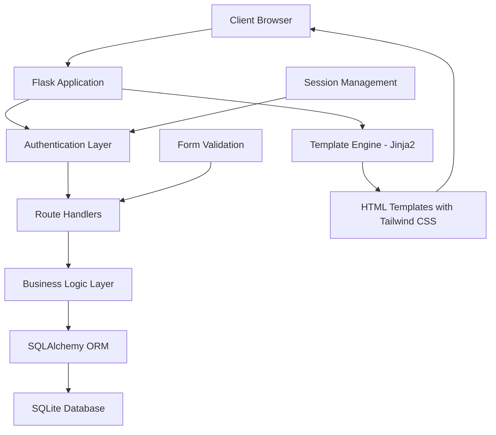
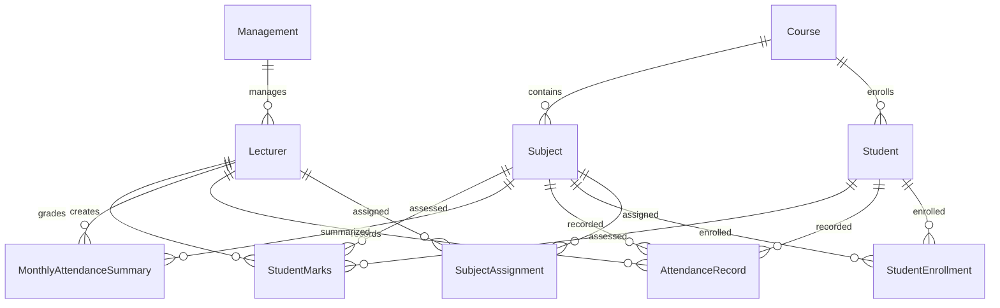

# Design Document

## Overview

Moulya is a Flask-based college management system with a clean separation between management and lecturer functionalities. The system follows a traditional MVC architecture with Flask handling routing and business logic, SQLAlchemy managing database operations, and Jinja2 templates rendering responsive HTML with Tailwind CSS styling. The design emphasizes modularity, maintainability, and scalability while adhering to the black-and-white UI aesthetic.

## Architecture

### High-Level Architecture



### Application Structure

```
moulya/
├── app.py                 # Main Flask application
├── config.py             # Configuration settings
├── models/               # Database models
│   ├── __init__.py
│   ├── user.py          # Management and Lecturer models
│   ├── academic.py      # Course, Subject, AcademicYear models
│   ├── student.py       # Student model
│   ├── attendance.py    # Attendance models
│   └── marks.py         # Marks models
├── routes/              # Route handlers
│   ├── __init__.py
│   ├── auth.py          # Authentication routes
│   ├── management.py    # Management portal routes
│   └── lecturer.py      # Lecturer portal routes
├── services/            # Business logic
│   ├── __init__.py
│   ├── auth_service.py
│   ├── management_service.py
│   └── lecturer_service.py
├── utils/               # Utility functions
│   ├── __init__.py
│   ├── validators.py
│   └── helpers.py
├── templates/           # HTML templates
│   ├── base.html
│   ├── auth/
│   ├── management/
│   └── lecturer/
├── static/              # Static files
│   ├── css/
│   └── js/
└── requirements.txt
```

## Components and Interfaces

### Database Models

#### User Management Models

**Management Model**
```python
class Management(db.Model):
    id = db.Column(db.Integer, primary_key=True)
    username = db.Column(db.String(80), unique=True, nullable=False)
    password_hash = db.Column(db.String(120), nullable=False)
    created_at = db.Column(db.DateTime, default=datetime.utcnow)
```

**Lecturer Model**
```python
class Lecturer(db.Model):
    id = db.Column(db.Integer, primary_key=True)
    lecturer_id = db.Column(db.String(20), unique=True, nullable=False)
    name = db.Column(db.String(100), nullable=False)
    username = db.Column(db.String(80), unique=True, nullable=False)
    password_hash = db.Column(db.String(120), nullable=False)
    created_at = db.Column(db.DateTime, default=datetime.utcnow)
    
    # Relationships
    subject_assignments = db.relationship('SubjectAssignment', backref='lecturer')
```

#### Academic Structure Models

**Course Model**
```python
class Course(db.Model):
    id = db.Column(db.Integer, primary_key=True)
    name = db.Column(db.String(100), nullable=False)
    code = db.Column(db.String(20), unique=True, nullable=False)
    duration_years = db.Column(db.Integer, default=3)
    
    # Relationships
    students = db.relationship('Student', backref='course')
    subjects = db.relationship('Subject', backref='course')
```

**Subject Model**
```python
class Subject(db.Model):
    id = db.Column(db.Integer, primary_key=True)
    name = db.Column(db.String(100), nullable=False)
    code = db.Column(db.String(20), nullable=False)
    course_id = db.Column(db.Integer, db.ForeignKey('course.id'), nullable=False)
    semester = db.Column(db.Integer, nullable=False)
    year = db.Column(db.Integer, nullable=False)
    
    # Relationships
    assignments = db.relationship('SubjectAssignment', backref='subject')
```

**Student Model**
```python
class Student(db.Model):
    id = db.Column(db.Integer, primary_key=True)
    roll_number = db.Column(db.String(20), unique=True, nullable=False)
    name = db.Column(db.String(100), nullable=False)
    course_id = db.Column(db.Integer, db.ForeignKey('course.id'), nullable=False)
    academic_year = db.Column(db.Integer, nullable=False)
    
    # Relationships
    enrollments = db.relationship('StudentEnrollment', backref='student')
    attendance_records = db.relationship('AttendanceRecord', backref='student')
    marks = db.relationship('StudentMarks', backref='student')
```

#### Operational Models

**Subject Assignment Model**
```python
class SubjectAssignment(db.Model):
    id = db.Column(db.Integer, primary_key=True)
    lecturer_id = db.Column(db.Integer, db.ForeignKey('lecturer.id'), nullable=False)
    subject_id = db.Column(db.Integer, db.ForeignKey('subject.id'), nullable=False)
    academic_year = db.Column(db.Integer, nullable=False)
```

**Student Enrollment Model**
```python
class StudentEnrollment(db.Model):
    id = db.Column(db.Integer, primary_key=True)
    student_id = db.Column(db.Integer, db.ForeignKey('student.id'), nullable=False)
    subject_id = db.Column(db.Integer, db.ForeignKey('subject.id'), nullable=False)
    academic_year = db.Column(db.Integer, nullable=False)
    enrolled_at = db.Column(db.DateTime, default=datetime.utcnow)
```

**Attendance Models**
```python
class AttendanceRecord(db.Model):
    id = db.Column(db.Integer, primary_key=True)
    student_id = db.Column(db.Integer, db.ForeignKey('student.id'), nullable=False)
    subject_id = db.Column(db.Integer, db.ForeignKey('subject.id'), nullable=False)
    date = db.Column(db.Date, nullable=False)
    status = db.Column(db.String(10), nullable=False)  # 'present' or 'absent'
    lecturer_id = db.Column(db.Integer, db.ForeignKey('lecturer.id'), nullable=False)

class MonthlyAttendanceSummary(db.Model):
    id = db.Column(db.Integer, primary_key=True)
    subject_id = db.Column(db.Integer, db.ForeignKey('subject.id'), nullable=False)
    lecturer_id = db.Column(db.Integer, db.ForeignKey('lecturer.id'), nullable=False)
    month = db.Column(db.Integer, nullable=False)
    year = db.Column(db.Integer, nullable=False)
    total_classes = db.Column(db.Integer, nullable=False)
```

**Marks Model**
```python
class StudentMarks(db.Model):
    id = db.Column(db.Integer, primary_key=True)
    student_id = db.Column(db.Integer, db.ForeignKey('student.id'), nullable=False)
    subject_id = db.Column(db.Integer, db.ForeignKey('subject.id'), nullable=False)
    assessment_type = db.Column(db.String(20), nullable=False)  # 'internal1', 'internal2', 'assignment', 'project'
    marks_obtained = db.Column(db.Float, nullable=False)
    max_marks = db.Column(db.Float, nullable=False)
    lecturer_id = db.Column(db.Integer, db.ForeignKey('lecturer.id'), nullable=False)
    created_at = db.Column(db.DateTime, default=datetime.utcnow)
```

### Route Structure

#### Authentication Routes (`/auth`)
- `GET /` - Landing page with login options
- `GET /management/login` - Management login form
- `POST /management/login` - Management authentication
- `GET /lecturer/login` - Lecturer login form
- `POST /lecturer/login` - Lecturer authentication
- `POST /logout` - Logout for both user types

#### Management Routes (`/management`)
- `GET /dashboard` - Management dashboard
- `GET /lecturers` - List all lecturers
- `POST /lecturers/add` - Add single lecturer
- `POST /lecturers/bulk` - Bulk add lecturers
- `GET /students` - List all students
- `POST /students/add` - Add single student
- `POST /students/bulk` - Bulk add students
- `GET /courses` - Manage courses
- `POST /courses/add` - Add new course
- `GET /subjects` - Manage subjects
- `POST /subjects/add` - Add new subject
- `GET /academic-years` - Manage academic years
- `POST /academic-years/add` - Add academic year

#### Lecturer Routes (`/lecturer`)
- `GET /dashboard` - Lecturer dashboard
- `GET /subjects` - View assigned subjects
- `GET /subjects/<id>/students` - View enrolled students
- `POST /subjects/<id>/students/add` - Add students to subject
- `POST /subjects/<id>/students/remove` - Remove students from subject
- `GET /subjects/<id>/attendance` - Attendance management
- `POST /subjects/<id>/attendance/daily` - Record daily attendance
- `POST /subjects/<id>/attendance/monthly` - Record monthly summary
- `GET /subjects/<id>/marks` - Marks management
- `POST /subjects/<id>/marks/add` - Add marks for assessment
- `GET /subjects/<id>/reports` - Student reports
- `GET /reports/attendance-shortage` - Attendance shortage report
- `GET /reports/marks-deficiency` - Marks deficiency report

### Service Layer Architecture

#### Authentication Service
```python
class AuthService:
    @staticmethod
    def authenticate_management(username, password)
    @staticmethod
    def authenticate_lecturer(username, password)
    @staticmethod
    def generate_lecturer_credentials(name, lecturer_id)
    @staticmethod
    def hash_password(password)
    @staticmethod
    def verify_password(password, hash)
```

#### Management Service
```python
class ManagementService:
    @staticmethod
    def add_lecturer(lecturer_data)
    @staticmethod
    def bulk_add_lecturers(lecturers_data)
    @staticmethod
    def add_student(student_data)
    @staticmethod
    def bulk_add_students(students_data)
    @staticmethod
    def create_course(course_data)
    @staticmethod
    def create_subject(subject_data)
    @staticmethod
    def setup_academic_year(year_data)
```

#### Lecturer Service
```python
class LecturerService:
    @staticmethod
    def get_assigned_subjects(lecturer_id)
    @staticmethod
    def get_subject_students(subject_id)
    @staticmethod
    def enroll_students(subject_id, student_ids)
    @staticmethod
    def unenroll_students(subject_id, student_ids)
    @staticmethod
    def record_daily_attendance(subject_id, attendance_data)
    @staticmethod
    def record_monthly_summary(subject_id, month, year, total_classes)
    @staticmethod
    def add_marks(subject_id, student_id, assessment_type, marks, max_marks)
    @staticmethod
    def generate_attendance_report(subject_id)
    @staticmethod
    def generate_marks_report(subject_id)
```

## Data Models

### Entity Relationship Diagram



### Data Validation Rules

1. **Unique Constraints**: Lecturer ID, Roll Number, Course Code, Subject Code per course
2. **Required Fields**: All models have mandatory fields that cannot be null
3. **Data Types**: Proper data types for IDs, names, dates, and numeric values
4. **Referential Integrity**: Foreign key constraints maintain data consistency
5. **Business Rules**: 
   - Attendance status must be 'present' or 'absent'
   - Marks cannot exceed maximum marks
   - Academic years must be valid (1, 2, or 3)
   - Semesters must be valid for the academic structure

## Error Handling

### Error Categories

1. **Authentication Errors**
   - Invalid credentials
   - Session expiry
   - Unauthorized access attempts

2. **Validation Errors**
   - Duplicate entries (Lecturer ID, Roll Number)
   - Invalid data formats
   - Missing required fields
   - Business rule violations

3. **Database Errors**
   - Connection failures
   - Constraint violations
   - Transaction rollback scenarios

4. **File Processing Errors**
   - Invalid Excel format
   - Bulk upload failures
   - File size limitations

### Error Handling Strategy

```python
class ErrorHandler:
    @staticmethod
    def handle_validation_error(error)
    @staticmethod
    def handle_database_error(error)
    @staticmethod
    def handle_authentication_error(error)
    @staticmethod
    def handle_file_processing_error(error)
```

### User-Friendly Error Messages

- Clear, actionable error messages
- Specific guidance for resolution
- Graceful degradation for system errors
- Logging for debugging purposes

## Testing Strategy

### Unit Testing

1. **Model Tests**
   - Database model validation
   - Relationship integrity
   - Business rule enforcement

2. **Service Tests**
   - Business logic validation
   - Data processing accuracy
   - Error handling scenarios

3. **Route Tests**
   - HTTP response validation
   - Authentication checks
   - Form processing

### Integration Testing

1. **Database Integration**
   - CRUD operations
   - Complex queries
   - Transaction handling

2. **Authentication Flow**
   - Login/logout processes
   - Session management
   - Role-based access

3. **End-to-End Workflows**
   - Complete user journeys
   - Multi-step processes
   - Error recovery

### Testing Tools

- **pytest** for unit and integration tests
- **Flask-Testing** for Flask-specific testing
- **SQLAlchemy testing utilities** for database tests
- **Coverage.py** for test coverage analysis

## UI/UX Design Principles

### Design System

1. **Color Scheme**: Strict black, white, and grayscale palette
2. **Typography**: Clean, readable fonts with proper hierarchy
3. **Layout**: Grid-based responsive design using Tailwind CSS
4. **Components**: Reusable UI components for consistency

### Responsive Design

1. **Mobile-First Approach**: Design for mobile, enhance for desktop
2. **Breakpoints**: Standard Tailwind CSS breakpoints (sm, md, lg, xl)
3. **Navigation**: Collapsible navigation for mobile devices
4. **Tables**: Responsive table design for data display

### Accessibility

1. **Semantic HTML**: Proper HTML structure and elements
2. **ARIA Labels**: Screen reader compatibility
3. **Keyboard Navigation**: Full keyboard accessibility
4. **Color Contrast**: High contrast for readability

### User Experience

1. **Clear Navigation**: Intuitive menu structure
2. **Feedback**: Immediate feedback for user actions
3. **Loading States**: Progress indicators for long operations
4. **Error States**: Clear error messages and recovery options

## Security Considerations

### Authentication Security

1. **Password Hashing**: Werkzeug password hashing
2. **Session Management**: Secure session handling
3. **CSRF Protection**: Cross-site request forgery protection
4. **Input Validation**: Server-side validation for all inputs

### Data Security

1. **SQL Injection Prevention**: SQLAlchemy ORM protection
2. **XSS Prevention**: Template escaping and validation
3. **File Upload Security**: Validation and sanitization
4. **Database Security**: Proper database permissions

### Application Security

1. **Environment Variables**: Sensitive configuration in environment
2. **Error Handling**: No sensitive information in error messages
3. **Logging**: Security event logging
4. **Rate Limiting**: Protection against abuse